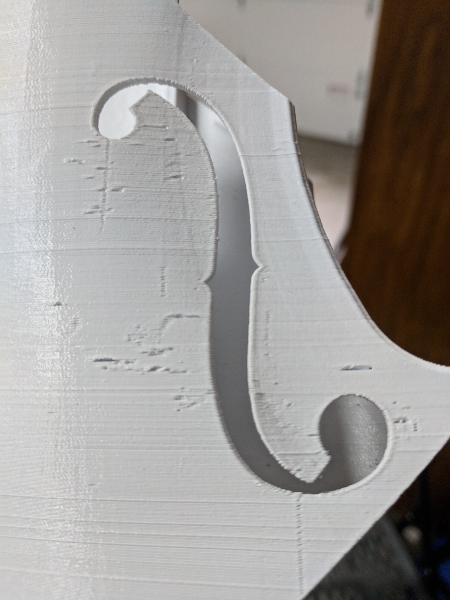
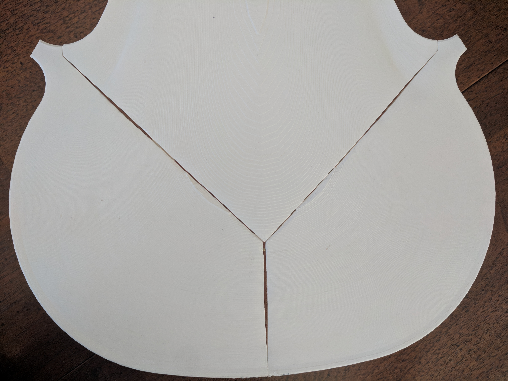
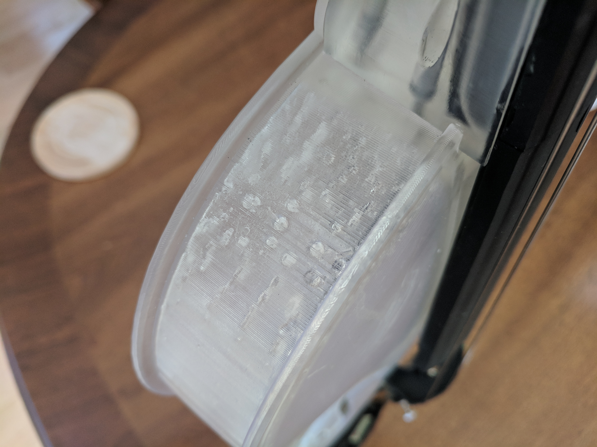
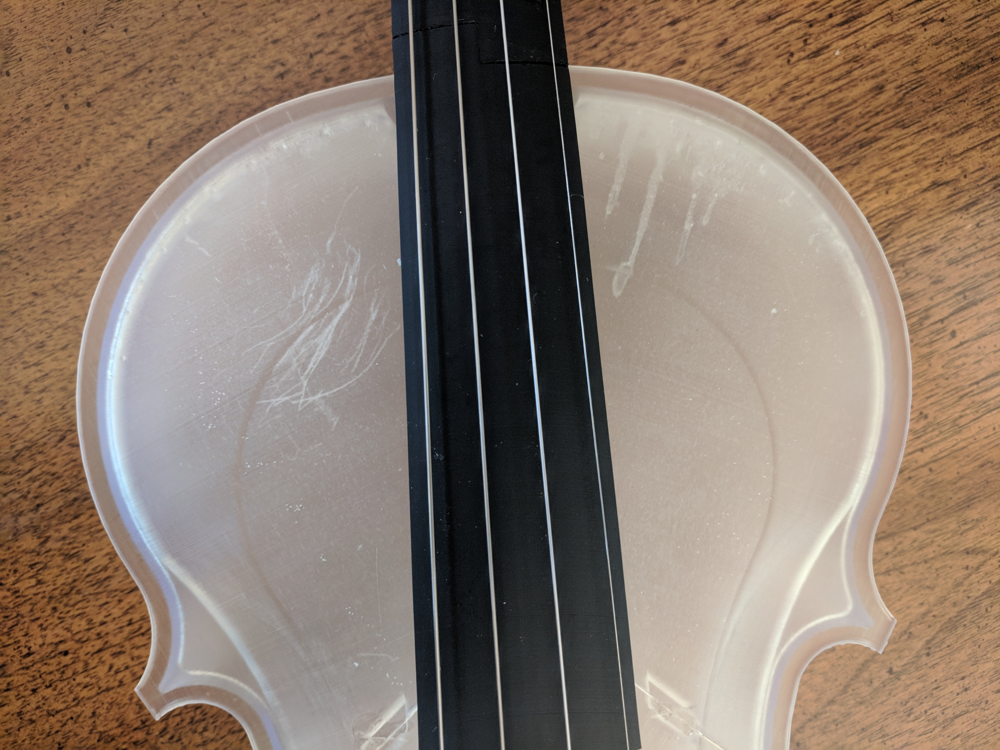

# Matt's Violin

My local makespace got a 3d printer, and I thought it would be a lot of fun to trying building a violin. I play a little bit of violin but I'm no master and I'm certainly no luthier, with that in mind these are some of my experiences in the process.

## Version 1.0

The 3d printer was an [Ultimaker 3 Extended](https://ultimaker.com/en/products/ultimaker-3) which has dual-extruders so you can print with water-soluble support material (PVA).  I had read about the [Hovaline](http://www.hovalabs.com/hova-instruments/hovalin) but I felt attached to the traditional shape of a violin with its scroll and multiple colors.  I found a [blog post](https://formlabs.com/blog/designing-a-3d-printed-acoustic-violin/) from Formlabs detailing a violin they designed and built.  I decided to move forward with that design.  So I started printing.

This part took about five days to print plus two more to dissolve the support material.  It is heavily striated and there are holes where a stream of PVA crossed the path where I wanted my violin to be.

I had much more success printing my parts laying down instead of standing up.  The striations almost look like a wood grain in that orientation and I didn't have any more issues with PVA leaving holes in the finished part.  I needed about four more five-day prints to make the main body and all the little bits.  The design calls for inserting carbon-fiber rods for structural support and the parts have perfectly-sized slots for those rods.  At least the slots are prefectly-sized if you have a perfect 3d printer.  I also found out on these parts that dissolving PVA seems to warm the PLA plastic of the part.

The carbon fiber won't fit, and the plastic is warping, maybe I can sand down the carbon fiber and fill in the gaps with epoxy?  Around this time my local makerspace aquired a [Formlabs Form 2](https://formlabs.com/3d-printers/form-2/).  This is the printer my violin was designed to be built on so I abandoned my first attempt but glued together the parts to create a pretty violin-shaped-object.  I'll probably donate this back to the shop for them to hang on the wall as decoration or something.

## Version 2.0

Printing on the Form 2 creates some *very* pretty results.  Even at the lowest resolution the prints are smooth, and at that resolution what took a month with the Ultimaker took a week with the Form 2.  Unfortunately the resin-based printing doesn't offer any sort of water-soluble support.  We need to print with physical supports that we clean up as part of post-processing the parts.  The shop only had clear and black resin, so I started printing my body in clear.  The supports are very difficult to clean out of the inside so they leave some visual imperfections.

I also scratched up the inside of the body when removing the support

Other than what are arguable workmanship errors, I think the clear resin makes some very pretty prints.

For the most part everything worked and I was able to assemble the 2.0 violin

I was able to string up the violin, but I could only ever actually play the A string. 

### Fingerboard

There are two carbon fiber rods under the fingerboard, and the space for these is very tight.  When attaching the fingerboard to the neck I couldn't get the fingerboard to come down flush.  As a result the bottom of the fingerboard touches the E string.  

### Pegs

The pegs use small copper rod inserts to increase the strength.  However it doesn't provide that much torsional strength and the pegs are long.  The peg for the D string broke several times and I couldn't get the G peg tight enough.

### Tailpiece

The tailpiece in the image is actually a store-bought part, not the tailpiece I printed.  The tailpeice accepts a fastener which loops around the end pin, but the STL file for the tailpiece doesn't have holes large enough for the recommended fastener.  The chinrest is also store-bought, but that's because the suggested nuts and bolts are expensive (several dollars each) and I could only find them in packs of 50 or 100.

## Version 2.1

With these observations I set out to make some modifications.  The folks over at Formlabs made the original CAD files available so I could modify as I saw fit.  I don't have any expereience with other CAD software but I didn't find OnShape to be the best expereience.  Then again it's web-based nature means I don't need to have a license for something else.  My modifications are availabe on [OnShape](https://cad.onshape.com/documents/b8124feaca6a2a50ba1787b9/w/c1523e0360917f6f89b82b6a/e/ed073b06fac225b9871622ed) and are as follows:  

 * I shortened the pegs by 10mm.  With a shorter peg they are much more structurally sound.  I haven't had one break on me yet.
 * I added a tiny bit of extra clearance for the carbon fiber rods under the fingerboard.  The spacing there is much more friendly now.
 * I enlarged the holes for the fastener in the tailpiece.  So far the holes still aren't big enough and I will probably increase the total space underneath the tailpiece.

The modular nature of the violin means I could remove the neck and fingerboard and only rebuild those parts.  Given my experience cleaning up support material I was very careful about where I printed supports.  This led to a total failure of the top part of the fingerboard to print (not enough support) as well as a partial failure of the lower part of the fingerboard.  I didn't notice that the lower portiton of the fingerboard was slightly bowed until I tried installing it.  So I broke it off because I really wanted to play this iteration.

[Video of my wife playing version 2.1](https://youtu.be/_Sm5WY6CksM)

## Next Steps

There's more work to do.  Before I finished 2.1, I had plans for a 3.0 "final" version which would use a freshly printed body with carefully designed support material and probably printing in white instead of clear.  I still need to fix the tailpiec, and maybe see if I can switch to a printed chinrest.  Keep an eye out here for further updates!